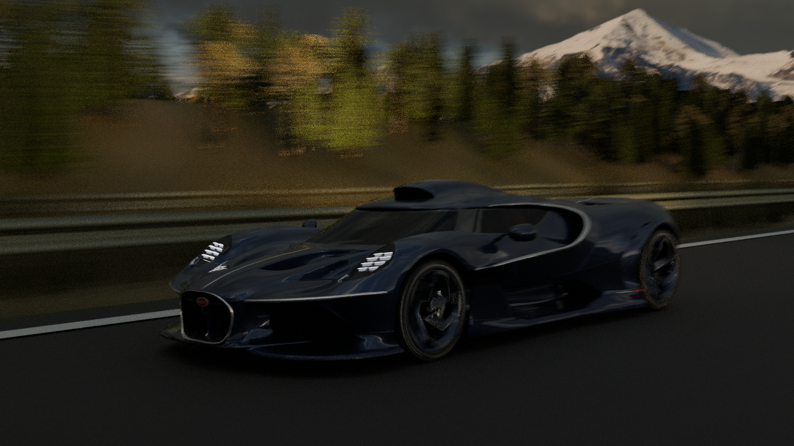
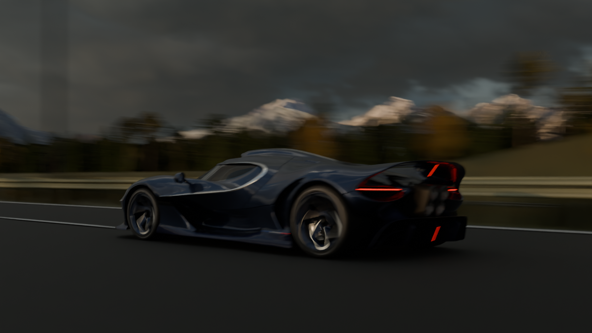
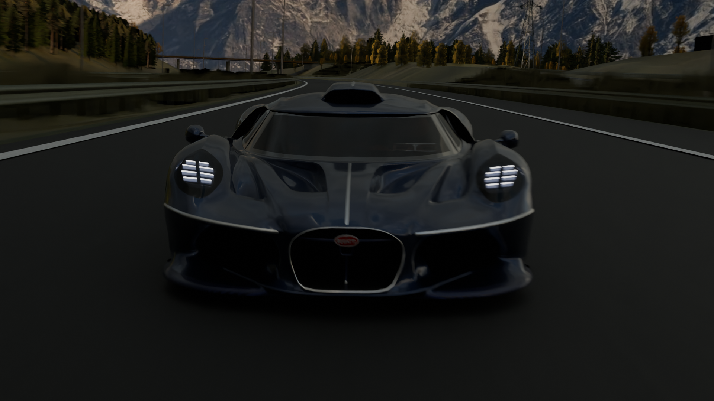
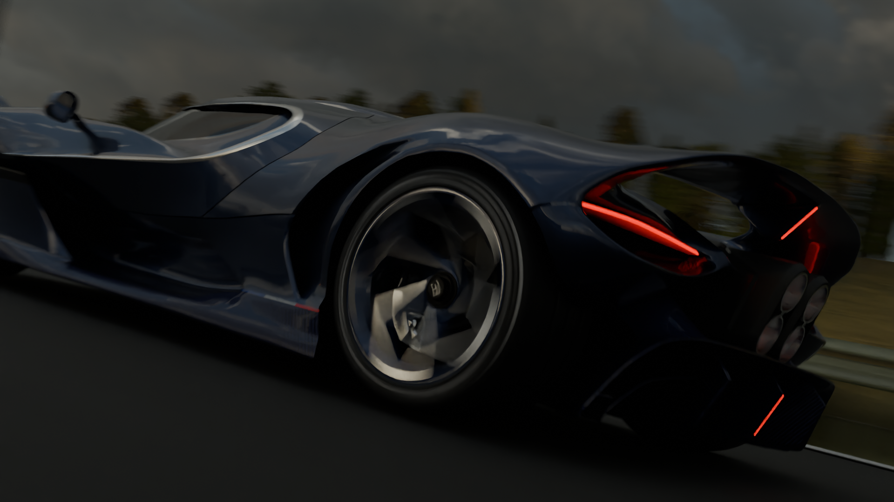
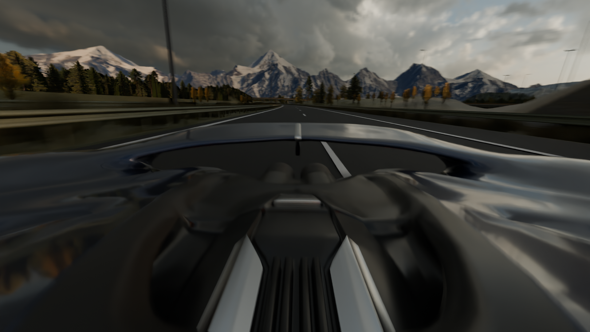
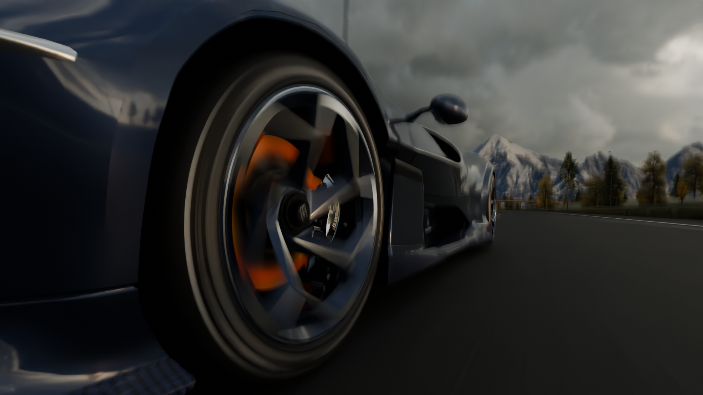
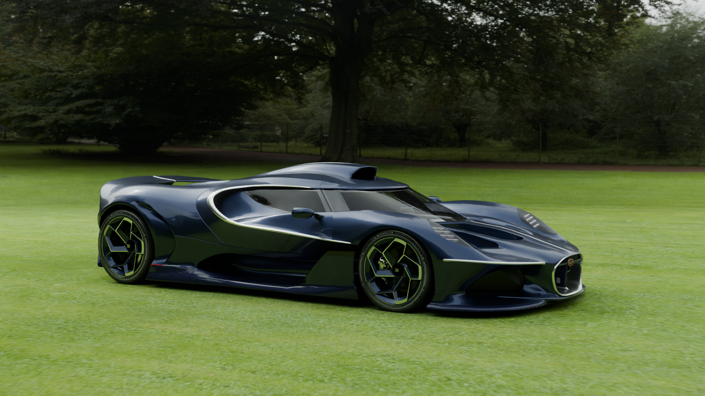
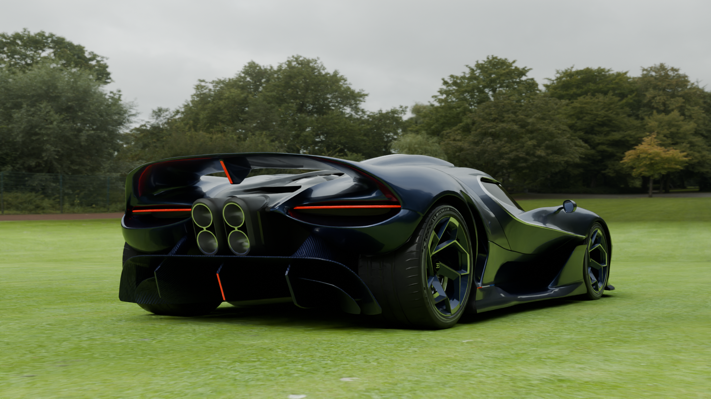
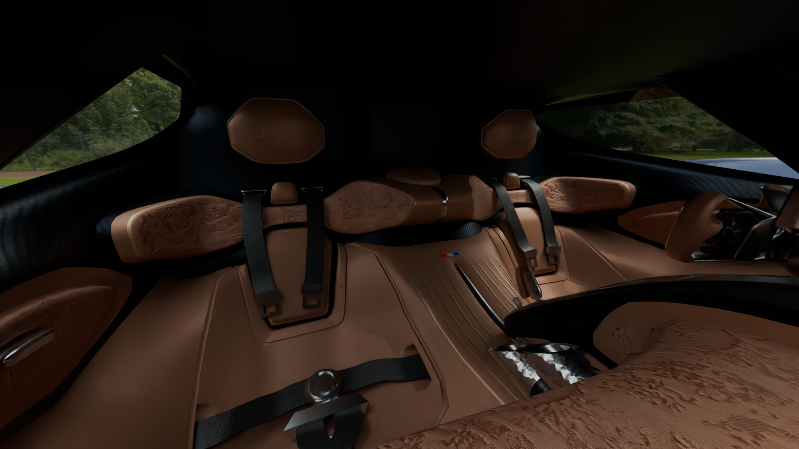
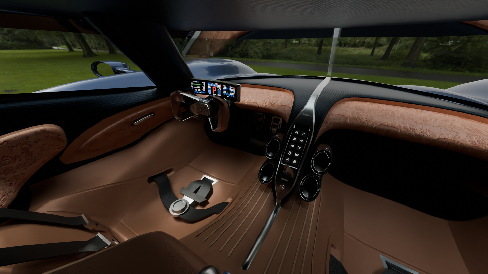

# BUGATTI DESTRIER — 3D MODEL & CINEMATIC

<table>
<tr>
<td></td>
<td></td>
</tr>
</table>

## Overview

A highly detailed 3D recreation of the **Bugatti Destrier**, modeled entirely from scratch in Blender.

The project was created as a major hard-surface modeling and cinematic project, with a focus on accurate proportions, clean topology, detailed mechanical and aerodynamic components, realistic materials, and a fully animated presentation.

The Destrier is a particularly challenging subject because it is a very new vehicle with limited publicly available reference material. I worked from the available images, renders, and references I could find online, combining them with careful observation and my own interpretation where references were limited.

---

<table>
<tr>
<td></td>
<td></td>
</tr>
<tr>
<td></td>
<td></td>
</tr>
</table>

---

## Concept & Reference

The project began by collecting available reference images from Pinterest and other online sources.

Because only a limited amount of detailed reference material was publicly available, the modeling process required a lot of visual analysis and reconstruction.

The car was developed progressively from the rear, through the sides, and toward the front while continuously refining the overall proportions and surface transitions.

---

<table>
<tr>
<td></td>
<td></td>
</tr>
</table>

---

## Modeling

The entire vehicle was modeled from scratch in Blender.

The main body was built using subdivision-based hard-surface modeling, with careful attention to maintaining clean topology across the complex body surfaces.

Major exterior components include:

* Main body shell
* Front grille
* Headlights
* Exterior aerodynamic fins
* Aero surfaces
* Panel gaps
* Bugatti badges and emblems
* Wheels and rims
* Brake components
* Tires
* Detailed tire surfaces
* Interior components
* Seats
* Dashboard
* Steering wheel
* Buttons and controls
* Additional interior details

The model was continuously refined throughout production to improve proportions, surface quality, topology, and small details.

---

<table>
<tr>
<td></td>
<td></td>
</tr>
</table>

---

## Materials & Textures

Custom materials and textures were created for the vehicle and its individual components.

The project includes detailed surface work across:

* Exterior paint
* Carbon-fiber components
* Metallic parts
* Wheels
* Brakes
* Tires
* Interior materials
* Glass
* Small mechanical and trim components

Normal maps and additional texture detail were used where necessary to add surface complexity without unnecessarily increasing geometry.

---

## Interior

The interior was modeled and detailed as part of the main vehicle rather than treating the car as an exterior-only asset.

This includes the dashboard, seats, steering wheel, controls, buttons, and other visible interior components.

---

## Animation & Scene

The completed vehicle was rigged to allow the car to be animated for the final cinematic.

Camera movement, lighting, and scene animation were created specifically for the final presentation.

An environment/map from an earlier project was reused as a starting point, then its textures were improved and the environment was optimized for rendering.

The final animation contains approximately **840 frames**.

---

## Rendering

The final cinematic was rendered using **Cycles**.

Due to the complexity of the scene and the hardware available during production, rendering was extremely demanding.

Average render time was approximately **6 minutes per frame**.

Despite the long render times, the final scene was completed and rendered as part of the finished project.

---

## Final Video

The final cinematic was created from the rendered animation and edited for video presentation.

**Watch the Bugatti Destrier Cinematic:**
[YOUTUBE_LINK](https://youtu.be/0gfVzRgbG9k?si=cSn0jMNbJaUCYcHy)

---

## Music

**HANTA (Slowed)** — SomberMvsic
[YOUTUBE_MUSIC_LINK](https://music.youtube.com/watch?v=ql-Ab27FL3Y&si=VrDa-nSw_6dFm2KS)

---

## References

Reference material was collected from publicly available images, renders, and automotive photography found online.

The Bugatti Destrier was modeled from scratch based on these references. No external 3D vehicle model was used as the base for the project.

---

## License

Licensed under **CC BY-NC 4.0**.
You may use, modify, and share this project for **non-commercial purposes**, with credit to **Binupa**.

**Commercial use or resale requires permission.**

[View the full CC BY-NC 4.0 license](https://creativecommons.org/licenses/by-nc/4.0/)

---

## Project Info

* **Software:** Blender
* **Project Type:** 3D Vehicle / Cinematic
* **Model:** Bugatti Destrier
* **Modeling:** From scratch
* **Rendering:** Cycles
* **Animation:** ~840 frames
* **Average Render Time:** ~6 minutes per frame
* **Total Work:** 150+ hours
* **Status:** Completed
